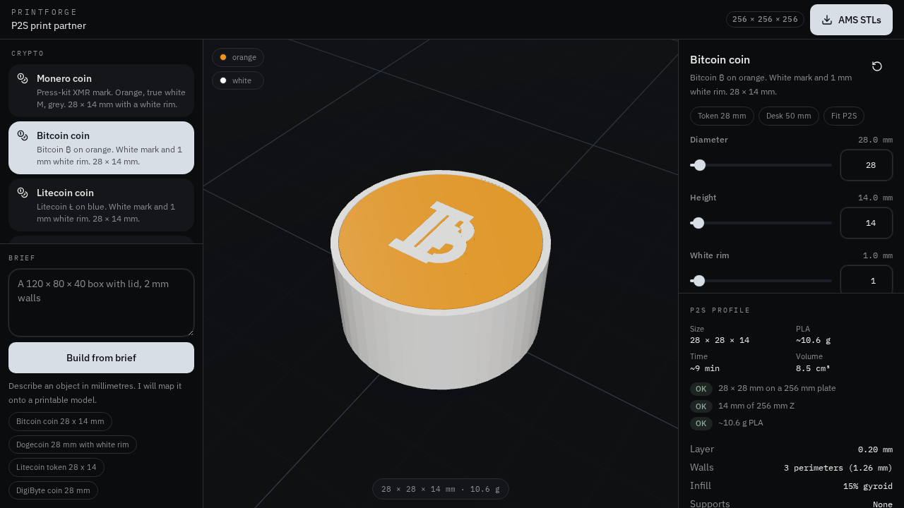
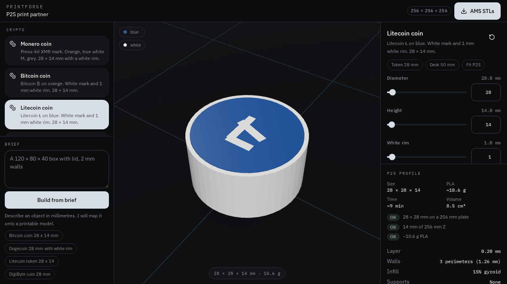
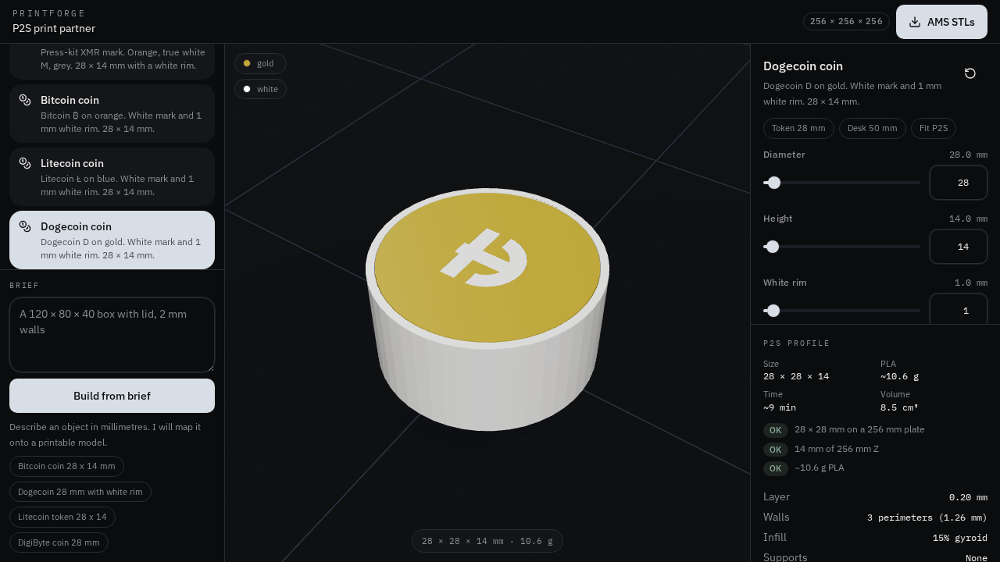
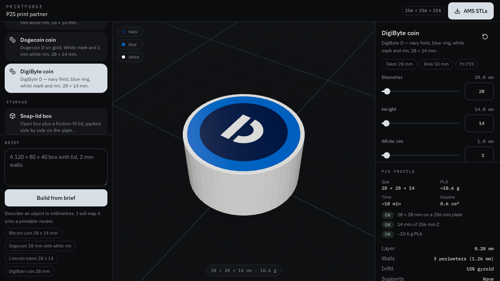
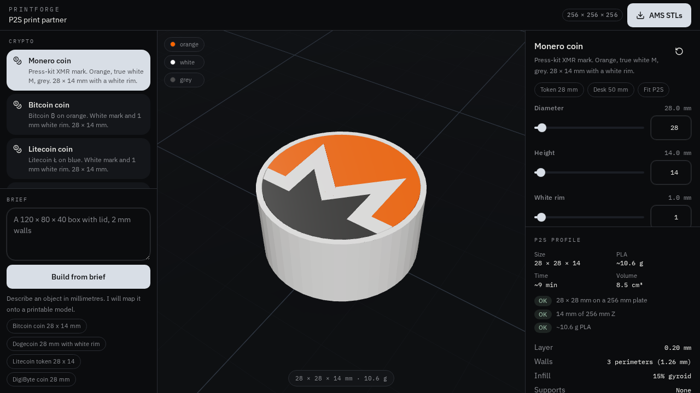

# PrintForge

Parametric CAD studio for the **Bambu Lab P2S**. Dial a model, preview it on a 256 mm bed, and download print-ready STLs — including AMS colour packs.

Built as a P2S print partner: crypto tokens, storage, desk, and everyday parts. Defaults are chosen for a 0.4 mm nozzle, no supports, and PLA.

## Crypto tokens

Five coins, same parametric shell: **28 mm diameter × 14 mm height × 1 mm white rim**. Through-colour so both faces read. Diameter, height, and rim stay live sliders.

| Coin | Field | Mark | Rim |
| --- | --- | --- | --- |
| Bitcoin | `#F7931A` orange | White ₿ | White 1 mm |
| Litecoin | `#345D9D` blue | White Ł | White 1 mm |
| Dogecoin | `#C2A633` gold | White D | White 1 mm |
| DigiByte | `#002352` navy + `#0066CC` ring | White D | White 1 mm |
| Monero | `#FF6600` orange / `#4C4C4C` grey | True white M | White 1 mm |

<p>
  
  
  
  
  
</p>

Each token is ~8 g of PLA. Prints on its face, 0.20 mm layers, 3 walls, no supports.

### AMS in Bambu Studio

1. Click **AMS STLs** — one file per colour, already aligned.
2. Import the first STL, right-click → **Add part** → remaining files.
3. Assign filaments to match the colour names.

Presets on every crypto model: **Token 28 mm**, **Desk 50 mm**, **Fit P2S**.

## Catalog

Crypto coins plus snap-lid boxes, divider bins, phone stands, cable clips, nameplates, washers, and other P2S-sized parts. Describe a part in the brief box to jump to a matching model.

## Run locally

```bash
npm install
npm run dev
```

Then open the app in a browser. `npm run build` produces a production bundle.

Requires Node 22+.

## Stack

- TanStack Start + Vite
- React Three Fiber for the live P2S bed preview
- JSCAD constructive solid geometry
- Binary STL export with colour packs
- Zustand for studio state

## License

MIT. Crypto marks belong to their respective projects; this repo only generates printable geometry from public brand colours and symbols.
